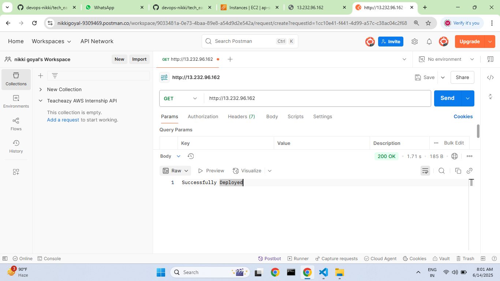
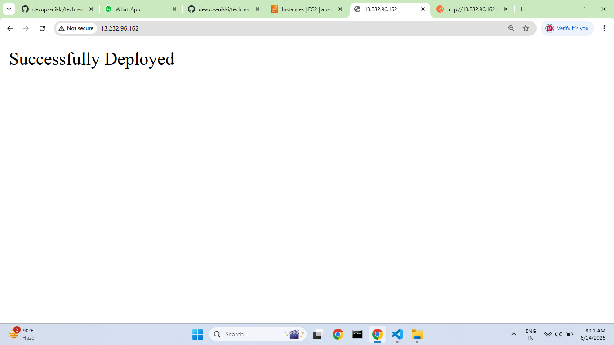

# Techeazy AWS Internship-DEVOPS ASSIGNMENT-1 
#  EC2 Java App Deployment with Terraform

## 📌 Overview

This project automates the deployment of a Java 21 application on an AWS EC2 instance using Terraform. The setup installs dependencies, deploys the app, and verifies it is running on **port 80**.

## 🛠️ Tech Stack

- **AWS EC2**
- **Terraform**
- **Java 21**
- **Postman** (for testing API endpoints)

## 🚀 Steps to Deploy

1. **Clone this repo:**
   
   git clone https://github.com/devops-nikki/tech_eazy_devops-nikki_aws_devops.git   
   cd tech_eazy_devops-nikki_aws_devops

2. **Set your AWS credentials as environment variables:**

   -export AWS_ACCESS_KEY_ID=your_key

   -export AWS_SECRET_ACCESS_KEY=your_secret_key

3. **Initialize and apply Terraform:**

   -terraform init
   
   -terraform validate
   
   -terraform plan
   
   -terraform apply

4. **Wait a few minutes until the app is reachable on the EC2 public IP via port 80.**

5. **Test API endpoints using Postman:**

   -Update the base URL with your EC2 public IP

   -Run requests to verify the app is up

   **🔐 Notes**

   -No credentials are hardcoded in the repo

   -Root user was used only for demo purposes

   -Elastic IP not used (public IP will change if instance is stopped)

   **🔍 Your Output Should Look Like:**

   **✅ API Working via Postman:**

   

   **JAVA App deployment Through Browser:**
  
   
   **After all the setup don't forget to run:**(for cost-saving)
   
     terraform destroy

**🙌 Author**

  Nikki Goyal
  Techeazy AWS Internship | June 2025
