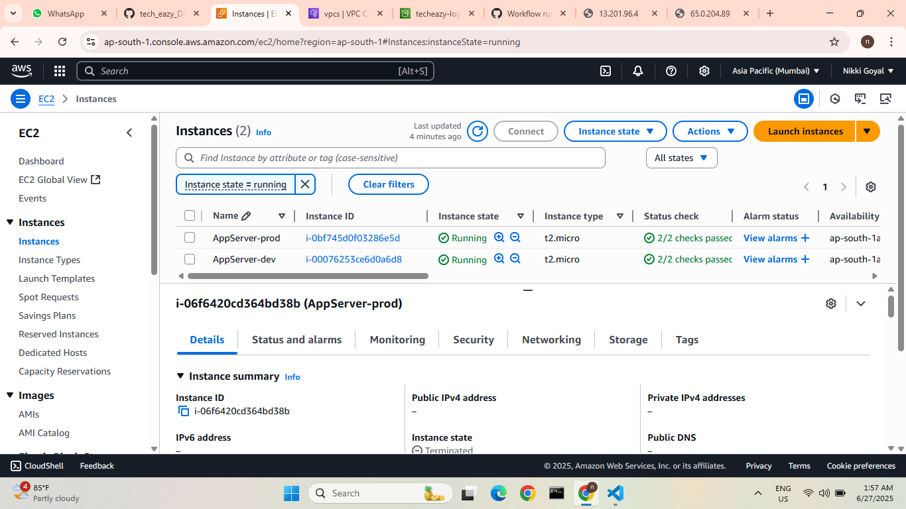
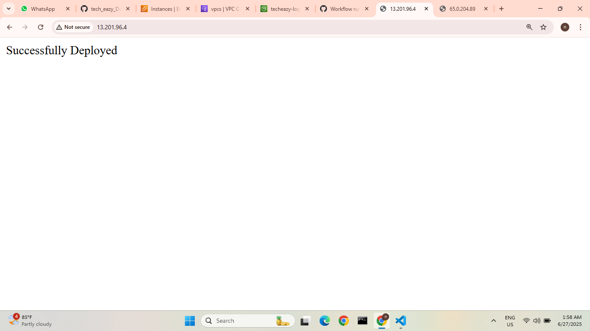
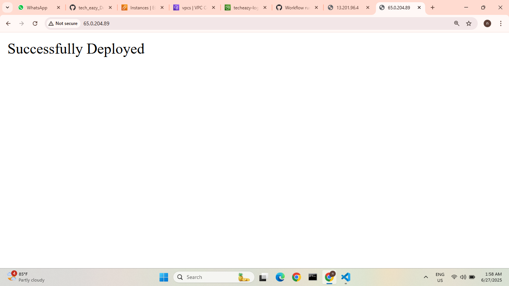
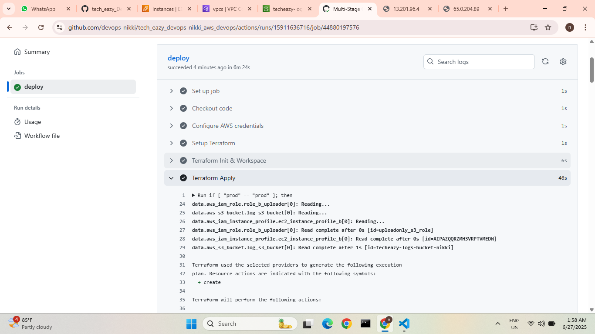
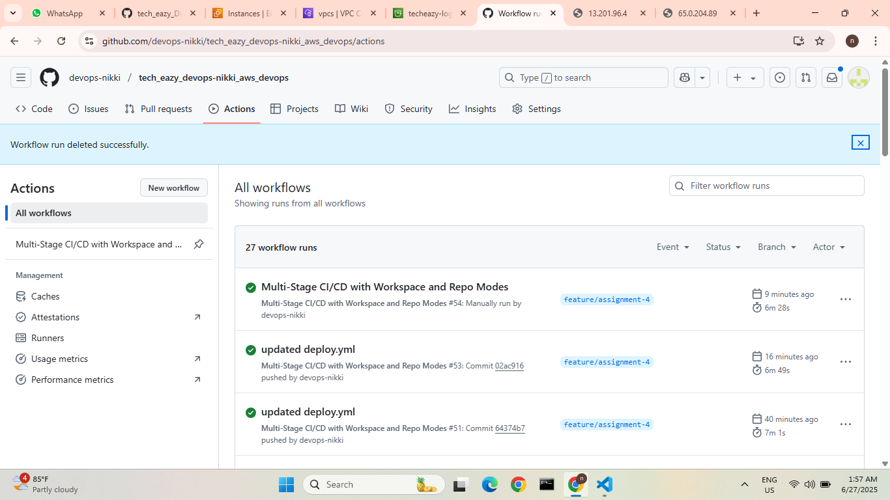

# Techeazy AWS Internship-DEVOPS ASSIGNMENT-1 
#  EC2 Java App Deployment with Terraform

## 📌 Overview

This project automates the deployment of a Java 21 application on an AWS EC2 instance using Terraform. The setup installs dependencies, deploys the app, and verifies it is running on **port 80**.

## 🛠️ Tech Stack

- **AWS EC2**
- **Terraform**
- **Java 21**
- **Postman** (for testing API endpoints)

## 🚀 Steps to Deploy

1. **Clone this repo:**
   
   `git clone https://github.com/devops-nikki/tech_eazy_devops-nikki_aws_devops.git`   
   `cd tech_eazy_devops-nikki_aws_devops`

2. **Set your AWS credentials as environment variables:**

   `-export AWS_ACCESS_KEY_ID=your_key`

   `-export AWS_SECRET_ACCESS_KEY=your_secret_key`


3. **Initialize and apply Terraform:**

   `terraform init`
   
   `terraform validate`
   
   `terraform plan`
   
   `terraform apply`

4. **Wait a few minutes until the app is reachable on the EC2 public IP via port 80.**

5. **Test API endpoints using Postman:**

   -Update the base URL with your EC2 public IP

   -Run requests to verify the app is up


   **🔐 Notes**

   -No credentials are hardcoded in the repo

   -Root user was used only for demo purposes

   -Elastic IP not used (public IP will change if instance is stopped)

   **🔍 Your Output Should Look Like:**

   **✅ API Working via Postman:**

   

   **✅ JAVA App deployment Through Browser:**
  
   
 **✅ After all the setup don't forget to run:**(for cost-saving)
 
   `terraform destroy`

# ✅ Techeazy AWS Internship -DevOps Assignment 2 
#    IAM, S3, Log Upload (Completed)

## 📌 Overview

This assignment automates secure log archival from EC2 instances to a private Amazon S3 bucket using Terraform and a Bash script. The project demonstrates key DevSecOps principles, including:

- IAM policy control
- EC2 lifecycle automation
- S3 lifecycle configuration
- Secure log upload and verification

---

## ✅ Completed Tasks

### 🔐 IAM Roles

- Created two custom IAM policies:
  - `ReadOnlyAccessToS3`
  - `WriteOnlyAccessToS3`
- Attached policies to respective roles using IAM Instance Profiles for **least privilege** access.

### 🪣 S3 Bucket Setup

- Created a **private** S3 bucket (`techeazy-logs-bucket-nikki`)
- Enabled **block public access**
- Configured **lifecycle rule** to clean logs older than 7 days

### 💻 EC2 Log Upload Automation

- Captured logs from `/var/log/my-app.log` 
- uploaded to S3 on **shutdown**
- Fully automated using:
  - Bash script: `user_data.sh.tf.tpl`
  - IAM write role

### 📂 Terraform Code Structure

| File | Description |
|------|-------------|
| `main.tf` | EC2 and networking setup |
| `iam_role_a.tf` and `iam_role_b.tf`| IAM policies and roles |
| `s3_bucket.tf` | S3 bucket creation and lifecycle rule |
| `user_data.sh.tftpl` | Bash script for uploading logs |
| `README.md` | Documentation |

---

## 🔍 Log Verification

- ✅ Successfully uploaded logs to S3 (`app_logs/`, `system_logs/`)
- ✅ Verified **read-only** access from another EC2 instance using the `ReadOnlyAccessToS3` IAM role through AWS-CLI

## 🚀 How to Deploy

`terraform init`

`terraform validate`

`terraform plan`

`terraform apply -var-file="your .tfvars file"`

# 📁 Files Modified

`main.tf`

`s3_bucket.tf`

`user_data.sh.tftpl`

`dev.tfvars`

`README.md`

## 🖼️ Deployment Screenshots

### ✅ Deployment Output


### ✅ EC2 Instances Running


### ✅ S3 bucket created


### ✅ Logs in S3


### ✅ verify role_a


 **✅ After all the setup don't forget to run:**(for cost-saving)
     `terraform destroy`

# ✅ Techeazy AWS Internship - DevOps Assignment 2 
#  IAM, S3, Log Upload (Completed)

## 📌 Overview

This assignment automates secure log archival from EC2 instances to a private Amazon S3 bucket using Terraform and a Bash script. The project demonstrates key DevSecOps principles, including:

- IAM policy control
- EC2 lifecycle automation
- S3 lifecycle configuration
- Secure log upload and verification

---

## ✅ Completed Tasks

### 🔐 IAM Roles

- Created two custom IAM policies:
  -ReadOnlyAccessToS3
  -WriteOnlyAccessToS3`
  -Attached policies to respective roles using IAM Instance Profiles for **least privilege** access.

### 🪣 S3 Bucket Setup

- Created a **private** S3 bucket (`techeazy-logs-bucket-nikki`)
- Enabled **block public access**
- Configured **lifecycle rule** to clean logs older than 7 days

### 💻 EC2 Log Upload Automation

- Captured logs from `/var/log/my-app.log` 
- Uploaded to S3 on **shutdown**
- Fully automated using:
  - Bash script: `user_data.sh.tf.tpl`
  - IAM write role

### 📂 Terraform Code Structure

| File | Description |
|------|-------------|
| `main.tf` | EC2 and networking setup |
| `iam_role_a.tf` and `iam_role_b.tf`| IAM policies and roles |
| `s3_bucket.tf` | S3 bucket creation and lifecycle rule |
| `user_data.sh.tftpl` | Bash script for uploading logs |
| `README.md` | Documentation |

---

## 🔍 Log Verification

- ✅ Successfully uploaded logs to S3 (`app_logs/`, `system_logs/`)
- ✅ Verified **read-only** access from another EC2 instance using the `ReadOnlyAccessToS3` IAM role through AWS-CLI

## 🚀 How to Deploy

 `terraform init`

`terraform validate`

`terraform plan`

`terraform apply -var-file="your.tfvars file"`

### Files Modified

 `main.tf`

 `s3_bucket.tf`

 `user_data.sh.tftpl`

 `dev.tfvars`

 `README.md`

## 📸 **Deployment Screenshots**

### ✅ Deployment Output


### ✅ EC2 Instances Running


### ✅ S3 Bucket Created


### ✅ Logs in S3


### ✅ IAM Role Verification


---

## ✅ After all the setup Done - don't forget to run:(for cost-saving)

 `terraform destroy`

## Collaborators Invited
All teammates and mentors have been added as collaborators to the GitHub repository.

## 🔁Pull Request Notes

Let me know if you'd like to merge the PR or wait for mentor approval.
Thank you for reviewing! 😊

## 🧑‍🤝‍🧑 Collaborators Invited-
All teammates and mentors have been added as collaborators to the GitHub repository.

## 🔁 Pull Request Notes

Let me know if you'd like to merge the PR or wait for mentor approval.
Thank you for reviewing! 😊

🙌 **Author**

  Nikki Goyal
  Techeazy AWS Internship | June 2025

# 🚀 DevOps Internship – Assignment 3  
## Terraform Infra + Java App EC2 Deployment + GitHub Actions CI/CD + S3 Logging

## ✅ Objective

Automate provisioning of AWS infrastructure using **Terraform**, deploy a **Spring Boot** application to **EC2**, set up a **CI/CD pipeline with GitHub Actions**, and configure **S3 bucket log archival** with lifecycle rules.


## 🧰 Tech Stack

| Technology        | Purpose                              |
|-------------------|--------------------------------------|
| Terraform         | Infrastructure as Code (IaC)         |
| AWS               | Cloud Services                       |
| GitHub Actions    | Continuous Integration/Deployment    |
| Spring Boot (Java)| Web Application                      |
| Amazon S3         | Log Storage & Lifecycle Management   |

```md
## 🧾 Folder Structure
techeazy-assignment/
├── Output_ss/
│   ├── app_logs.png
│   ├── ec2-deployed.png
│   ├── ec2.png
│   ├── postman.png
│   ├── public_ip.png
│   ├── s3_bucket.png
│   ├── system_logs.png
│   └── verify_role_a.png
│
├── ec2-deployment/
│   ├── iam_instance_profile.tf
│   ├── iam_role_a.tf
│   ├── iam_role_b.tf
│   ├── main.tf
│   ├── output.tf
│   ├── s3_bucket.tf
│   ├── vpc.tf
│   ├── variables.tf
│   ├── terraform.tfvars
│   ├── terraform.tfstate
│   ├── terraform.tfstate.backup
│   └── scripts/
│       └── user_data.sh.tftpl
│
├── .github/
│   └── workflows/
│       └── deploy.yml
│
├── Techeazy AWS internship API.postman_collection (1).json
└── README.md
```


## 🔐 GitHub Secrets Used

| Secret Name           | Purpose                      |
|-----------------------|------------------------------|
| `AWS_ACCESS_KEY_ID`   | Access key for AWS IAM user  |
| `AWS_SECRET_ACCESS_KEY` | Secret key for AWS IAM user|


## 🏗️ Infrastructure Overview

Provisioned using **Terraform**:

- **Custom VPC**     
- **Security Group**: Allows inbound **HTTP (80)** and **SSH (22)**  
- **EC2 Instance**: ubuntu, `t2.micro`, bootstrapped via `user_data.sh`  
- **S3 Bucket**: For log uploads  
- **IAM Role** + **Instance Profile**: Allows EC2 to upload logs to S3  
- **S3 Lifecycle Rule**: Automatically deletes logs after 30 days  

---

## ⚙️ EC2 Bootstrapping (user_data.sh.tftpl)

Upon launch, EC2 performs:

1. Installs **Java**, **Maven**, and **AWS CLI**
2. Clones the GitHub repo (`${REPO_URL}`)
3. Builds the app using `mvn clean install`
4. Starts the app on **port 80**
5. Uploads logs:
   - `/var/log/cloud-init.log` → `s3://<log_s3_bucket_name>/system_logs/cloud-init-log`
   - `/var/log/my-app.log` → `s3://<log_s3_bucket_name>/app_logs/my-app-log`
6. Signals app readiness by uploading `app_ready.txt` to:
   - `s3://<log_s3_bucket_name>/status/app_ready.txt`
7. Auto-shutdown after defined time (`shutdown_after_minutes`)

---

## 📤 Final Git Commit

`git add .`

`git commit -m "✅ Final Assignment 3: Full Terraform Infra + Java EC2 App + GitHub Actions CI/CD + S3 Logs"`

`git push origin feature/assignment-3`

## 🔁 GitHub Actions CI/CD Workflow

### 🎯 Trigger  
Runs on **push** to `feature/assignment-3` branch

### 🧱 Steps:

1. Checkout repository
2. Set up AWS credentials from **GitHub Secrets**
3. Run Terraform (`init`, `apply`) using `dev.tfvars`
4. Get EC2 public IP
5. Wait for EC2 to upload `app_ready.txt` to S3
6. Validate HTTP 200 response from the app URL
7. Mark workflow as **success**

---

## ✅ CI/CD Highlights

- ✅ **Fully automated** from provisioning to validation  
- 🔒 **Secure** – uses IAM roles and GitHub Secrets  
- 🕵️‍♂️ **Smart wait** – waits for EC2 readiness via S3 signal  
- ⚙️ **Dynamic IP detection** – no hardcoding

## 🧩 Steps in `.github/workflows/deploy.yml`
1. **Checkout Code**
2. **Setup Terraform**
3. **Configure AWS Credentials**
4. **Terraform Init**
5. **Terraform Plan -var-files="stage.tfvars(dev.tfvars)"**
6. **Terraform apply -var-files="stage.tfvars(dev.tfvars)"**
7. **Check App Health via curl & Browser**
8. **Finish**

## 📸 Screenshots & Proofs

### 1️⃣ EC2 Instance Running  
✅ Java app successfully launched an EC2 instance.

   

### 2️⃣ Logs in S3  
✅ Logs like `cloud-init.log`, `my-app.log`, and `app_ready.txt` found under correct prefixes.
📂 Example S3 paths:
- `s3://<your-bucket-name>/system_logs/cloud-init.log`  
- `s3://<your-bucket-name>/app_logs/my-app.log`  
- `s3://<your-bucket-name>/status/app_ready.txt`
   

   **Lists of logs in s3 bucket**
    

   **App_logs**
    

   **System_logs**
    


### 3️⃣ GitHub Actions – CI/CD  
✅ All steps executed, including waiting for readiness and validating the app endpoint.

   
  

### 4️⃣ Spring Boot App Live on EC2  
✅ Application accessible via public IP over **port 80**  
📍 `http://<ec2-public-ip>` → Returns **HTTP 200**

   

---

## 🧹 Cleanup

To avoid AWS charges, run:

`terraform destroy`

## ✅ Final Output Summary

| Output                         | Value / Status                 |
|--------------------------------|--------------------------------|
| EC2 Public IP                  | http://<your-ec2-ip>           |
| S3 Log Upload                  | ✅ Successful                   |
| Application Health             | ✅ HTTP 200 OK                  |
| Terraform Apply                | ✅ Success                      |
| GitHub Actions CI/CD Pipeline | ✅ All steps passed             |

## ✨ Author

👩‍💻 **Nikki Goyal**  
🎓 Role: AWS DevOps Intern – TechEazy Consulting  
💡 Skills: AWS | Terraform | GitHub Actions | DevOps | CI/CD | Java | S3  
🔗 LinkedIn: [linkedin.com/in/nikki-goyal-devops](https://www.linkedin.com/in/nikki-goyal-devops)

#  🚀 Techeazy AWS Internship – Devops- Assignment 4 
# 🚀 Multi-Stage Infrastructure Deployment with Terraform & GitHub Actions

This project automates a **multi-stage (dev and prod) deployment** system using:

- 🧱 **Terraform** for provisioning AWS resources  
- ☁️ **AWS EC2, IAM, S3**  
- 🤖 **GitHub Actions** for CI/CD  
- 🔐 Secure integration of both private and public GitHub repositories

---

## 🧩 What This Project Does

- Sets up reusable AWS infrastructure using Terraform
- Handles both **development** and **production** environments via Terraform workspaces
- Clones the application source code from:
  - a **public GitHub repo** for the `dev` stage
  - a **private GitHub repo** for the `prod` stage
- Deploys a Java web application on EC2 instance
- Uploads logs to a **single shared S3 bucket**, organized by stage
- Performs **health checks** using a status file
- Automatically shuts down EC2 instance after a configurable time

---

## ⚙️ How It Works

- Terraform provisions:
  - EC2 instance with startup script (user_data)
  - IAM Roles a & b with instance profile
  - Shared **S3 bucket** (created once and reused by both stages)
- GitHub Actions:
  - Handles CI/CD for both stages
  - Uploads logs from EC2 to S3 in stage-based folders
    ```
    s3://<shared-bucket>/<stage>/logs/
    s3://<shared-bucket>/<stage>/status/
    ```
  - `dev` stage uses public repo — no GitHub token needed
  - `prod` stage uses private repo — requires GitHub token
- Health check:
  - Script uploads `app_ready.txt` in the corresponding stage folder to confirm successful deployment

> ✅ Logs from both `dev` and `prod` are stored in **the same S3 bucket**, but **under their own separate folders** based on stage — no duplication or conflicts.

---

## 🔐 GitHub Secrets Required

Create these secrets in GitHub Actions:

| Name                    | Description                               |
|-------------------------|-------------------------------------------|
| `AWS_ACCESS_KEY_ID`     | AWS IAM user's access key                 |
| `AWS_SECRET_ACCESS_KEY` | AWS IAM user's secret access key          |
| `PRIVATE_REPO_TOKEN`    | GitHub token for accessing private repo   |
| `PRIVATE_REPO`          | username/repo_name for `prod` stage       |
| `PUBLIC_REPO`           | username/repo_name for `dev` stage        | 

---

## 🛠️ What You Need To Do

Before running the workflow:

- ✅ Set up a **public GitHub repo** for `dev` (can be the provided one)
- ✅ Fork and make a **private GitHub repo** for `prod` stage
- ✅ Configure your AWS IAM user with EC2, S3, and IAM access
- ✅ Add the above **GitHub Secrets** to your repository

---

## 🚦 Workflow Usage

You can trigger the deployment in two ways:

### 1. ✅ **Automatic Trigger**
Push a Git tag to run the workflow:
- `deploy-dev` → runs deployment for the dev stage
- `deploy-prod` → runs deployment for the prod stage

### 2. 🔘 **Manual Trigger**
Go to **GitHub Actions → Run workflow**:
- Select your desired `stage` (dev or prod)
- Click **Run workflow**

> ⚠️ Run the `dev` stage first — it creates the shared resources like S3, IAM, etc.  
> Then run the `prod` stage, which **reuses** those resources using `data` blocks in Terraform.

---

## 📂 S3 Logs & Status

After each deployment:

- Logs go to:
s3://<your-shared-bucket>/dev/logs/ 
s3://<your-shared-bucket>/prod/logs/

- App readiness file is uploaded as:

s3://<your-shared-bucket>/dev/status/app_ready.txt 
s3://<your-shared-bucket>/prod/status/app_ready.txt

---

---

## 📸 Screenshots

> 📁 All screenshots are stored in: `output-4/`

### ✅ Running Instances for dev/prod


### ✅ Successfull deployment for dev


### ✅ Successfull deployment for prod


### ✅ S3 Logs (Dev and Prod)


### ✅ GitHub Actions - Dev


### ✅ GitHub Actions - Prod


### ✅ Successfull Workflow for both stage-dev/prod



## ✅ Final Notes

- Dev stage creates resources. Prod stage **reuses** them via `data` blocks
- IAM instance profile and roles are **shared** between both environments
- GitHub token is **not hardcoded** — it is securely passed as a secret only in `prod`
- S3 bucket is **common** across both stages and separated logically by folder structure
- Health validation waits for `app_ready.txt` before passing

# 🚀 TechEazy AWS Internship - Devops Assignment 5 – 
# 🚀 CloudWatch Monitoring and Alerts with Multi-Stage Deployment

This assignment extends the previous infrastructure to implement **CloudWatch-based log monitoring**, **metric filtering**, and **SNS alerts** in a multi-stage setup (`dev`, `prod`) using Terraform and GitHub Actions.

---

## 🎯 Objective

- Upload EC2 instance logs to **CloudWatch Logs**
- Filter logs for `Error` and `Exception` keywords
- Create **SNS topic** and email alert on log match
- Download **CloudWatch Agent config** from GitHub
- Automatically deploy and validate using **GitHub Actions**

---

## 🛠️ What Was Implemented

### 🔸 CloudWatch Integration
- Installed **Amazon CloudWatch Agent** via `user_data`
- Downloaded config file from GitHub based on selected stage
- Pushed logs like `/var/log/messages` and `/var/log/cloud-init.log` to CloudWatch

### 🔸 Metric Filter & Alarm (manual)
- Metric filter (for `Error`, `Exception`) added manually via Console
- Alarm created to trigger email via SNS when error detected

### 🔸 IAM Role Update
- Reused existing IAM role (Role B)
- Attached **combined policy** for S3 upload + CloudWatch logging

### 🔸 SNS Setup
- Created SNS topic and email subscription
- Confirmed email for notifications

### 🔸 Terraform Files Updated/Created
- `main.tf`: EC2 deployment and logging setup
- `cloudwatch.tf`: Log group and agent config
- `iam.tf`: CloudWatch permissions added to Role B
- `sns.tf`: SNS topic and subscription
- `user_data_cloudwatch.sh.tftpl`: Boot script for agent + app
- `cloudwatch-config.json`: Fetched dynamically per stage
- `dev.tfvars` / `prod.tfvars`: Configurable per environment

### 🔸 GitHub Workflow Reused
- Used same **`deploy.yml`** from Assignment 4 for CI/CD
- Based on stage, downloaded public/private repo and config

---

## 📌 Important Notes

- Metric filter must be created **after logs start appearing**
- CloudWatch config is downloaded from GitHub (not S3)
- SNS topic requires email confirmation to work
- No new IAM instance profile — reused existing from Assignment 4
- Terraform destroy **does not delete log groups** (needs manual cleanup or extra config)

---

## ✅ Final Outputs (Assignment 5)

- [x] EC2 deployed with log agent
- [x] Logs uploaded to CloudWatch
- [x] SNS topic created and confirmed
- [x] Metric filter manually tested
- [x] Email alert received on error log
- [x] Working across `dev` and `prod`
